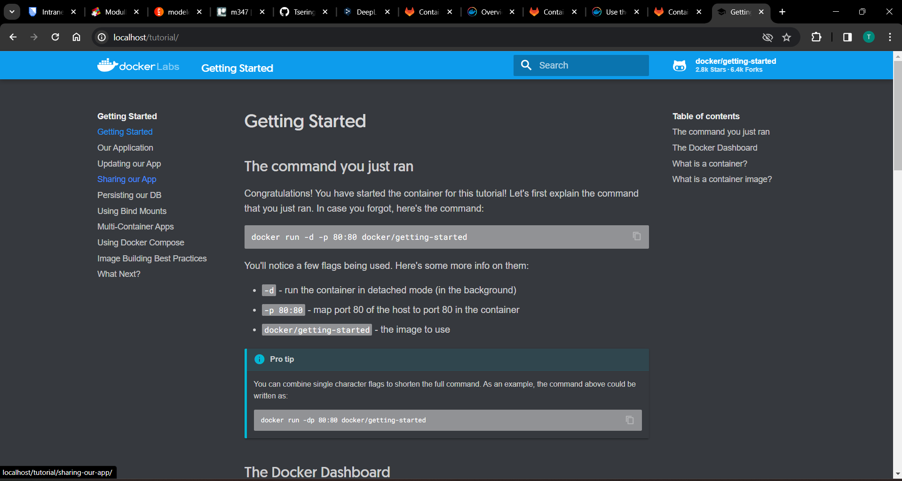
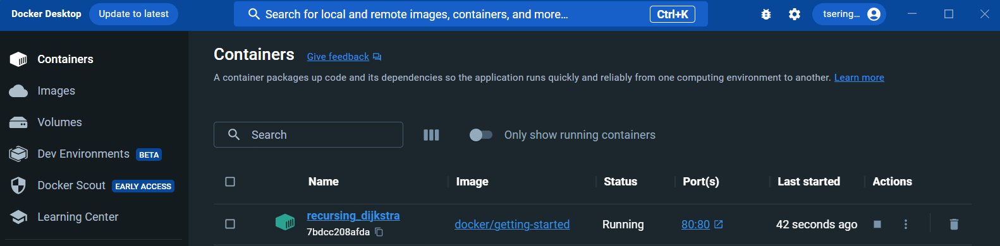

# KN01-Docker Grundlagen

### A. Installation:
1. Screenshot der Webseite, nachdem Sie den ersten Container erstellt haben.
  

2. Screenshot der Containers in Docker Desktop, der Ihren Container zeigt.
  

### B. Docker Command Line Interface (CLI) (50%)
1. Alle Befehle auflistet, die Sie eben verwendet haben.  
    - `docker version`
       Um die Docker-Version zu überprüfen.  
    - `docker search --filter=is-official=true ubuntu` oder
`docker search --filter=is-official=true nginx` Um das offizielle Ubuntu- / Nginx-Docker-Image auf Docker Hub zu erhalten. 

2. Erklärungen zu den Befehlen, falls erwartet.  
    - `docker run -d -p 80:80 docker/getting-started`  

3. Screenshots gem. den Bemerkungen in der Ausführungsliste.