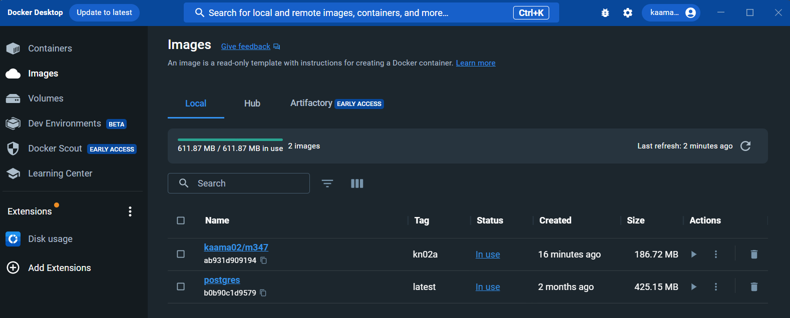
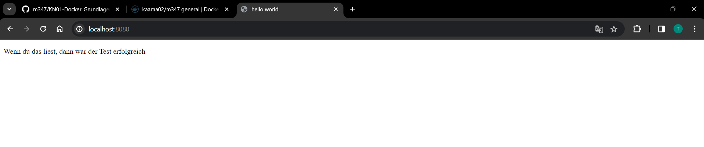
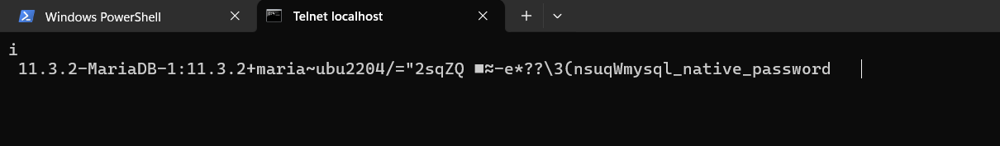
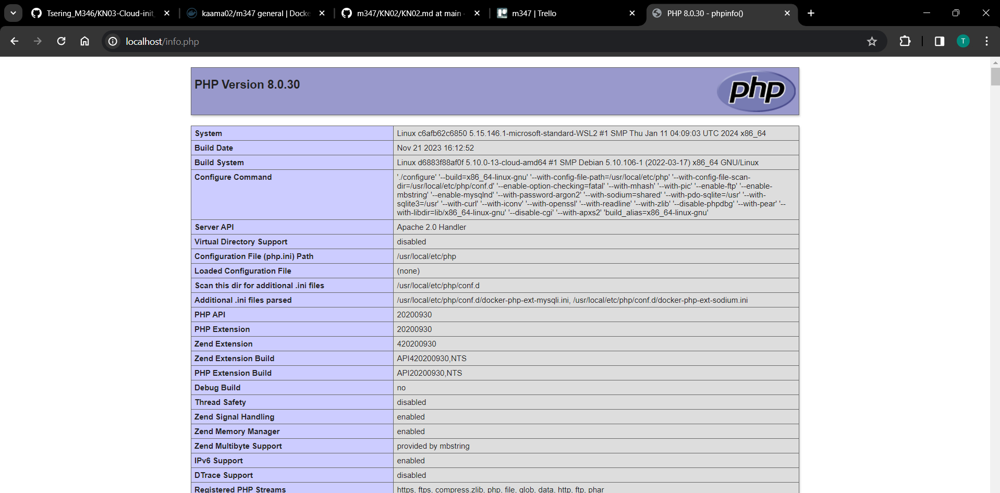
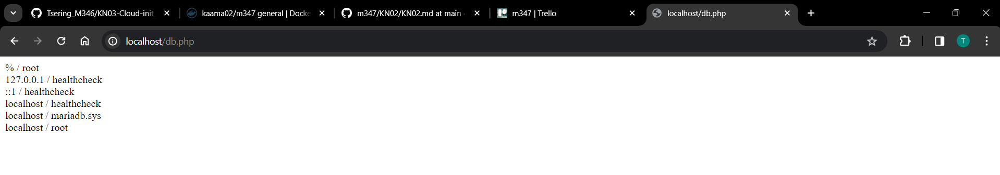

 # KN02-Dockerfile

 ### A. Dockerfile I
1. Dokumentiertes Dockerfile

    `FROM nginx` Basisimage für den Webserver, in diesem Fall nginx  
    `COPY static-html-directory /var/www/html` Kopiert den Inhalt des Verzeichnisses static-html-directory in das Verzeichnis /var/www/html im Container  
    `EXPOSE 80` Legt fest, dass der Container Port 80 nach aussen freigibt, um den Webserver zu erreichen  

2. Dockerfile, welches mit den entsprechenden Zeilen wie oben beschrieben:
[Dockerfile](A/dockerfile)

3. Notwendige Docker-Befehle für das build:  
`docker build -t kaama02/m347:kn02a .`

4. Befehl für den Start des Containers: 
`docker run -d -p 8080:80 kaama02/m347:kn02a`  

5. Befehle für dem push in das private Repository:  
`docker login`,  
`docker push kaama02/m347:kn02a`

6. Screenshot aus Docker Desktop, welcher das Image kn02a zeigt:
  

7. Screenshot der HTML-Seite, der die Seite helloworld.html zeigt, nachdem der Container gestartet wurde:  
  

 ### B. Dockerfile II

1. DB: telnet Befehl der zeigt, dass der Zugriff auf den DB Server funktioniert (Screenshot):
  

2. DB: Dockerfile für Ihren DB-Container: [Dockerfile](B/dockerfile-db)

3. DB: docker build und docker run Befehle für Ihren DB-Container:  
`docker build -t kn02b-db .`  
`docker run -d --name kn02b-db -p 3306:3306 kn02b-db`

4. Web: Screenshots der beiden Seiten info.php und db.php:
  

5. Web: Dockerfile für Ihren Web-Container:
[Dockerfile](B/dockerfile-web)

6. Web: docker build und docker run Befehle für Ihren Web-Container:  
`docker build -t kn02b-web:latest -f dockerfile-web .`  
`docker run -d --name kn02b-web -p 80:80 --link kn02b-db:db kn02b-web`

7. Web: Angepasste PHP-Dateien:  
[info.php](B/info.php)  
[db.php](B/db.php)