# KN03 - Netzwerk, Sicherheit

### A. Eignenes Netzwerk (100%)
1. Screenshots der Befehle und deren Resultate. Achtung: Sie können Befehle zusammenfassen.

    - Zuerst erstelle ich das benutzerdefinierte Netzwerk "tbz", "bridge ist pre-defined":  
        `docker network create -d tbz`  
        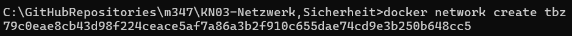  

    - Dann habe ich die Container busybox1, busybox2, busybox3 und busybox4 mit dem nginx-Image erstellt und sie den entsprechenden Netzwerken zugewiesen:  
        `docker run --name busybox1 --network bridge -d nginx`  
        `docker run --name busybox2 --network bridge -d nginx`  
        `docker run --name busybox3 --network tbz -d nginx`  
        `docker run --name busybox4 --network tbz -d nginx`  
        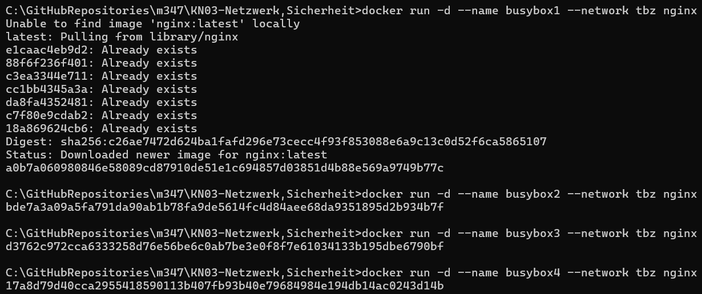  

    - Anschließend installiere ich die Netzwerk-Tools in jedem Container:  
        `docker exec -it busybox1 apt-get update`, `docker exec -it busybox1 apt-get install net-tools iputils-ping`  
        `docker exec -it busybox2 apt-get update`, `docker exec -it busybox2 apt-get install net-tools iputils-ping`  
        `docker exec -it busybox3 apt-get update`, `docker exec -it busybox3 apt-get install net-tools iputils-ping`  
        `docker exec -it busybox4 apt-get update`, `docker exec -it busybox4 apt-get install net-tools iputils-ping`  
        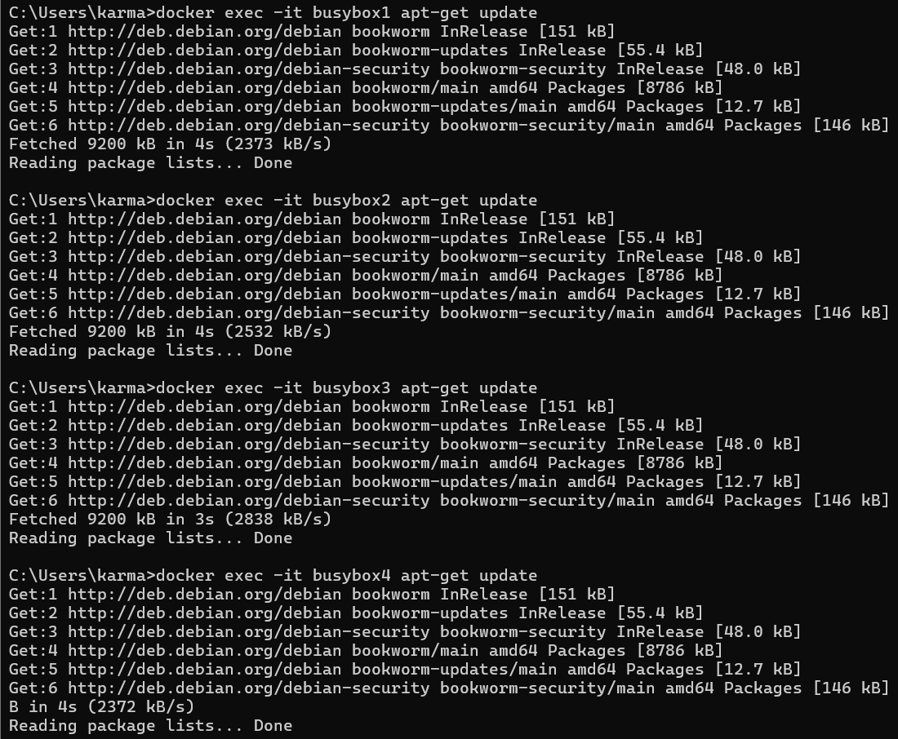  
        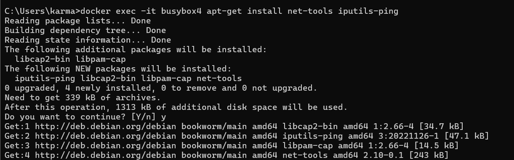  

    - IP-Adressen von busybox1, busybox2, busybox3 und busybox4 erhalten:  
        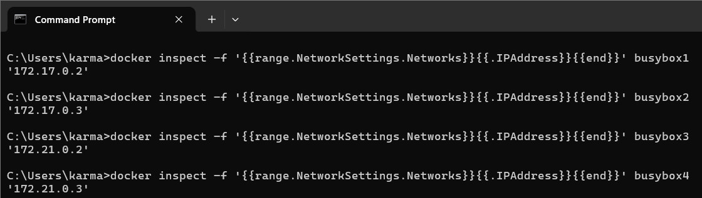  
        busybox1: 172.17.0.2  
        busybox2: 172.17.0.3  
        busybox3: 172.21.0.2  
        busybox4: 172.21.0.3  
    
    - TBZ network setting:  
        subnet: 172.21.0.0/16  
        default gateway: 172.21.0.1  
        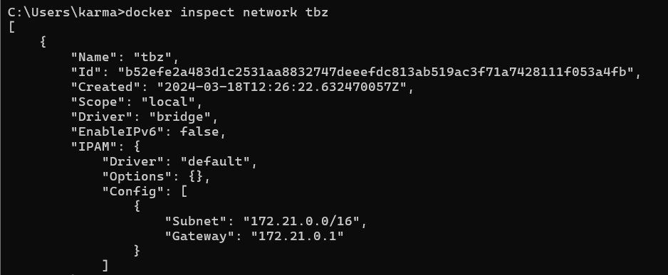
    
    - bridge network settings:  
        subnet: 172.17.0.0/16  
        default gateway: 172.17.0.1  
        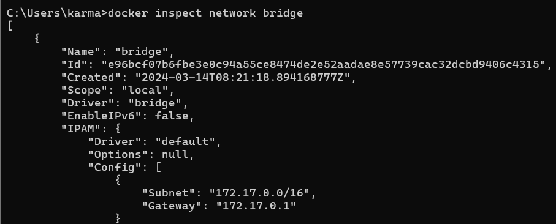

    - ***Interaktive Session auf busybox1 gestartet:***  
        Default gateway: 172.17.0.1  
        `docker exec -it busybox1 sh`  
        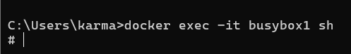  

    - ping busybox2 und ping busybox3:  
        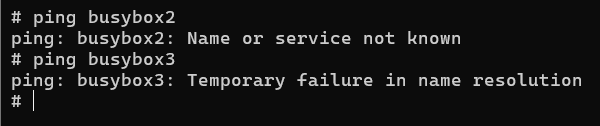  

    - ping ip-von-busybox2 und ping ip-von-busybox3:  
        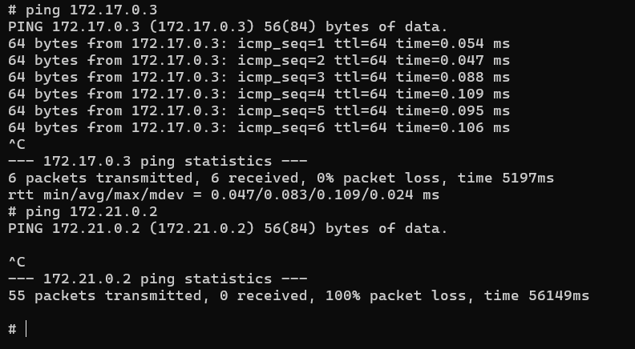  
    
    - ***Interaktive Session auf busybox3 gestartet:***  
        Default gateway: 172.17.0.1  
        `docker exec -it busybox1 sh`  

    - ping busybox1 und ping busybox4:  
        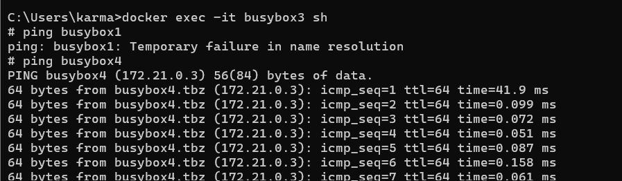  

    - ping ip-von-busybox1 und ping ip-von-busybox4:  
        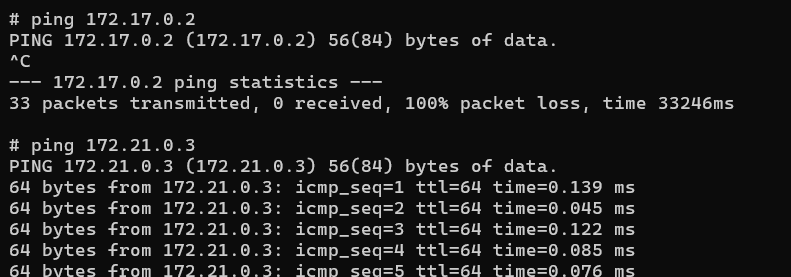  

2. Erklären Sie die Gemeinsamkeiten und Unterschiede. Wie kommen die Zustande und was ist Ihre Schlussfolgerung.  

    <strong>Gemeinsamkeiten:</strong>  
    1. Beide Netze, das Standard-Bridge-Netz und das benutzerdefinierte "tbz"-Netz, ermöglichen die Kommunikation zwischen Containern, die in dasselbe Netzsegment (Subnetz) eingebunden sind.
    
    <strong>Unterschiede:</strong>  
    1. Der Unterschied besteht darin, dass die Container mit dem Standard-Bridge-Netzwerk nur teilweise verbunden sind, nämlich nur über die IP-Adresse, die sich im Laufe der Zeit ändern kann. Wenn ich jedoch mein eigenes Netzwerk erstelle, kann ich Containernamen verwenden, die sich im Laufe der Zeit nicht ändern.

3. Betrachten Sie nun KN02.
    In KN02, the containers in the same gateway could not communicate via the container name but with the (--link), the name is linked with the IP address, which enables the container to communicate.

    - In welchem Netzwerk befanden sich die beiden Container?  
      busybox1: bridge  
      busybox3: tbz  

    - Wieso konnten die miteinander reden?  
      The two containers that were located in the "tbz" network could talk to each other via their names or IP addresses because they were in the same network segment (subnet). Communication between containers in the same network is enabled by default and does not require any special configurations.
