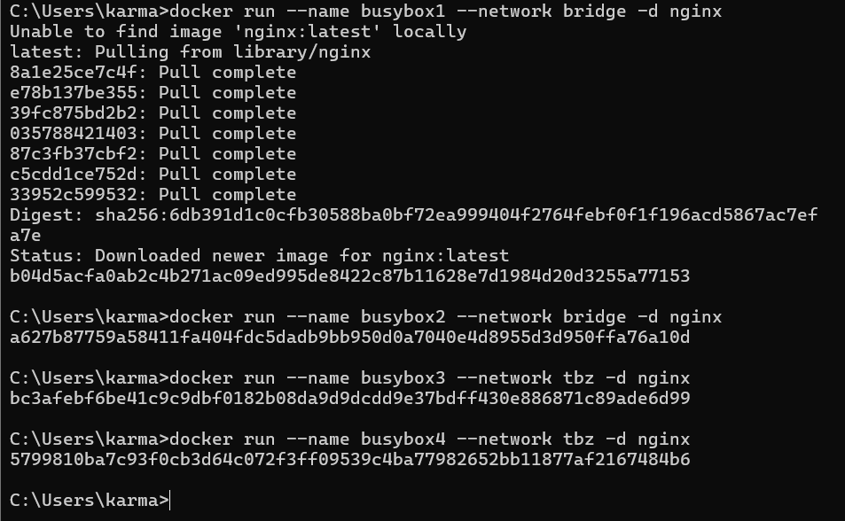

# KN03 - Netzwerk, Sicherheit

### A. Eignenes Netzwerk (100%)
1. Screenshots der Befehle und deren Resultate. Achtung: Sie können Befehle zusammenfassen.

    - Zuerst erstelle ich das benutzerdefinierte Netzwerk "tbz":  
          
    - Dann habe ich die Container busybox1, busybox2, busybox3 und busybox4 im entsprechenden Netzwerk erstellt und gestartet. Ich verwende das nginx-Image:
          
    - Anschließend installiere ich die Netzwerk-Tools in jedem Container:
          

    - IP-Adressen von busybox1, busybox2, busybox3 und busybox4 erhalten
          
    
    - TBZ network setting:
        

    - 

    - interaktive Session auf busybox1 gestartet:
          

2. Führen Sie die Befehle in einer sinnvollen Reihenfolge aus.
Erklären Sie die Gemeinsamkeiten und Unterschiede. Wie kommen die Zustande und was ist Ihre Schlussfolgerung.

3. Betrachten Sie nun KN02.
    - In welchem Netzwerk befanden sich die beiden Container?

    - Wieso konnten die miteinander reden?
