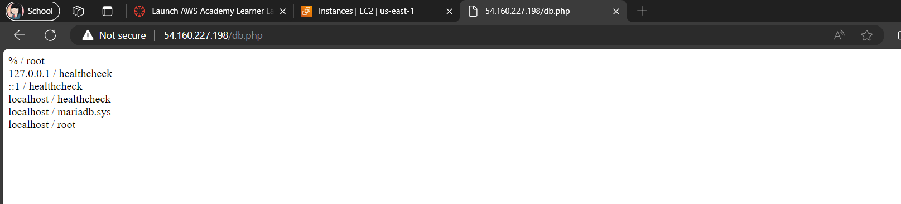

# KN04 - Docker Compose

## A. Docker Compose: Lokal (60%)

#### a. Verwendung von Original Images
1. Screenshot der Seite *info.php*. Scrollen Sie dabei zuerst runter bis die Felder *REMOTE_ADDR*
und *SERVER_ADDR* sichtbar sind:
  

2. Screenshot der Seite *db.php*. Sie zeigen, dass beide Images im gleichen Netzwerk sind.
  

3. `docker-compose up` :  
- builds/creates, 
- starts 
- connects 
all containers that are defined in the docker compose file.

#### b. verwendung Ihrer eigenes Images

1. Screenshots der beiden Seiten
  
  

3. Erklärung wieso der Fehler auftritt  
Dieser Fehler tritt auf, weil die Seite auf die Datenbank zugreift, aber die Konfiguration oder die Verbindungsinformationen nicht korrekt sind. Um dieses Problem zu lösen, sollten Sie sicherstellen, dass die Verbindungsdaten in der db.php-Datei korrekt konfiguriert sind, einschliesslich des Hostnamens, des Benutzernamens und des Passworts.

## B. Docker Compose: Cloud (40%)

1. Screenshots der aufgerufenen Seiten, inkl. sichtbarer URLs. Bei *info.php* sollen wieder die IPs sichtbar sein!
  
  
