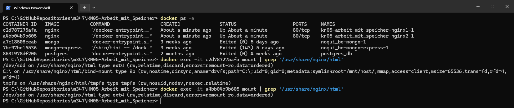

# KN05 - Arbeit mit Speicher

## A. Bind mounts (40%)

#### 1. Liste der Befehle, die notwendig waren und der Screencas, der den beschriebenen Prozess zeigt: 
1. erstellt und betreibt einen Docker-Container mit nginx-Image und bind mount  
`docker run --name kn05a -p 8080:80 -v C:/GitHubRepositories/m347/KN05-Arbeit_mit_Speicher/KN05a/:/usr/share/nginx/html/kn05a -d nginx`  
  

2. Kopiert das Bash-Skript "output.sh" vom Hostsystem in den Container  
`docker cp output.sh 4cd184cd65ae:/usr/share/nginx/html/kn05a/output.sh`  
  

3. Zugriff auf die Container-Shell über das Terminal  
`docker exec -it 4cd184cd65ae /bin/bash`  
4. Verzeichnis wechseln, in dem sich das Skript befindet  
`cd /usr/share/nginx/html/kn05a`  
5. Ausführen des Skripts  
`bash output.sh`  
  

## B. Volumes (30%)

#### 1. Liste der Befehle, die notwendig waren und der Screencas, der den beschriebenen Prozess zeigt:
1. Ein Volume erstellt:  
`docker volume create kn05-b_shared_volume`  
  

2. Erstellung und Ausführung von zwei Containern. Mit dem Flag --mount wird das zuvor erstellte Volume in jeden Container gemountet:  
`docker run -d --name kn05b-container-1 --mount source=kn05-b_shared_volume,target=/shared nginx`  
` docker run -d --name kn05b-container-2 --mount source=kn05-b_shared_volume,target=/shared nginx`  
  

3. Die Konsole des ersten Containers wird geöffnet, um eine .txt-Datei zu erstellen und einige Inhalte in die Shared File zu schreiben.  
`docker exec -it kn05b-container-1 /bin/bash`  
`echo "Content from container1" >> /shared/shared_file.txt`  
Die Konsole des zweiten Containers wird geöffnet, um den Inhalt der gleichen Datei zu lesen.  
`docker exec -it kn05b-container-2 /bin/bash`  
`cat /shared/shared_file.txt`  
  

## C. Speicher mit docker compose (30%)

#### 1. Auszug mit dem Befehl mount im ersten Container, der zeigt, dass alle drei Speichertypen hinzugefügt wurden.
  

#### 2. Auszug mit dem Befehl mount im zweiten Container, der zeigt, dass der Speichertyp hinzugefügt wurde.
  

  

