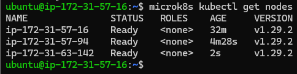

# KN06 Kubernetes I

## A. Installation 
#### `microk8s kubectl get nodes auf`
  

## B. Verständnis für Cluster

#### 1.   

#### 2.   

#### 3.   

#### 4.   

#### 5.   

#### 6. Unterschied zwischen den Befehlen `microk8s` und `microk8s kubectl`:  