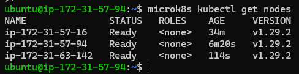
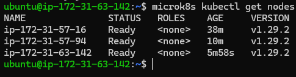
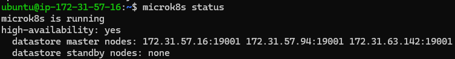
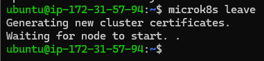
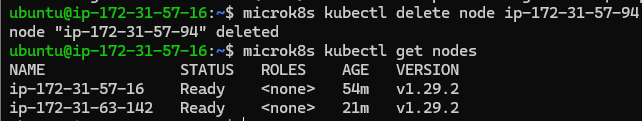
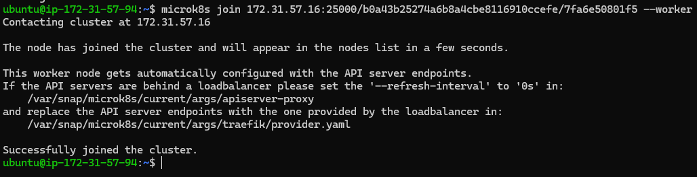
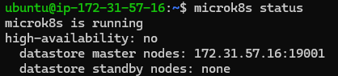
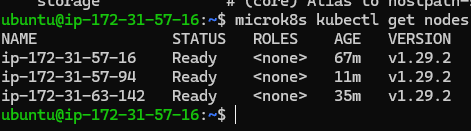
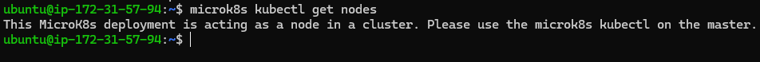

# KN06 Kubernetes I

## A. Installation 
#### `microk8s kubectl get nodes`
<strong> Node 1: </strong>
  

## B. Verständnis für Cluster

#### 1. Rufen Sie microk8s kubectl get nodes auf einem zweiten der drei Instanzen auf.  
<strong> Node 2: </strong>  
  

<strong> Node 3: </strong>  
  

#### 2. Rufen Sie den Befehl microk8s status auf und schauen Sie die ersten paar Zeilen an (vor "addons"). Was bedeuten diese?  

  
The first line `microK8s is running` indicates that the MicroK8s service is running on the current node.The `high-availability: yes` line shows that the MicroK8s cluster is configured for high availability (ensures redundancy and resilience by maintaining a consistent and synchronized data store across multiple nodes). `datastore master nodes: 172.31.57.16:19001 172.31.57.94:19001 172.31.63.142:19001` This section lists the IP addresses and ports of the connected nodes with the master node. `datastore standby nodes: none` line indicates that there are no standby nodes available. Standby nodes would typically be replicas of master nodes that can take over in the event of a failure to maintain data integrity and availability.

#### 3. Entfernen Sie einen Node vom Cluster.  
On the node to be removed:  
  

On the master node:   
  

#### 4. Fügen Sie nun den Node wieder dem Cluster hinzu, aber dieses Mal als Worker (--worker):  
  

#### 5. Rufen Sie nochmals den Befehl `microk8s status` auf. Was ist der Unterschied und woher kommt dieser.  
  
This is because one of the nodes is now a worker node and these do not run on the Kubernetes control plane. the cluster no longer has HA

#### 6. Rufen Sie nochmals `microk8s kubectl get nodes` auf, sowohl auf einem der Master als auch auf dem Worker. Dokumentieren Sie die Resultate mit Screenshots. Wieso stimmt dies überein mit dem Result des Befehls microk8s status ?  
master:  
  
worker:  
  
As the worker node does not work on the control plane, it also has no status. This means that it can only be called up by the master node.

#### 7. Unterschied zwischen den Befehlen `microk8s` und `microk8s kubectl`:  

`microk8s` is used to administer the entire MicroK8s environment, while `microk8s kubectl` focuses on managing the workloads and resources within the Kubernetes cluster itself.