# KN06 Kubernetes II

## A) Begriffe und Konzepte erlernen

### Difference between Pods and Replicas

**Pods:** A Pod is the smallest deployable unit in Kubernetes, encapsulating one or more containers that share resources like networking and storage. Pods are ephemeral, meaning they can be recreated or moved as needed by Kubernetes.

**Replicas:** A replica is an exact copy of a Pod. Replicas are created to ensure that a specific number of Pods are always running, providing fault tolerance and scalability. If a Pod crashes or is deleted, a new replica will automatically be created.

### Difference between Service and Deployment

**Service:** A Service provides a stable interface to access a group of Pods. It abstracts the underlying Pods and offers a stable IP address or DNS name for access, regardless of the lifespan of individual Pods.

**Deployment:** A Deployment acts as a blueprint that defines how many copies of a specific Pod (replicas) should be deployed. It ensures smooth operation and updates for the Pods, offering features like rollbacks and rollouts.

### Problem Solved by Ingress

**Ingress** enables applications within a Kubernetes cluster to be accessed externally in a user-friendly manner. It provides routing rules for HTTP and HTTPS requests. Ingress allows you to use a user-friendly URL or domain name to access an application instead of knowing the specific IP addresses or ports of individual services.

### StatefulSet: Purpose and Example

**StatefulSet** ensures the management of Pods that require a stable state. It ensures that Pods have consistent, predictable names and stable storage allocations. StatefulSets are particularly useful for stateful applications that need to persist data over time. An example use case would be a messaging system that requires stable ID assignments for each process and must ensure no messages are lost if a Pod is restarted.  

## B) Demo Projekt

#### 1. Sie haben in Teil A Begrifflichkeiten erklärt und hier in Teil B ein Projekt durchgeführt. Sie haben einen Teil der Services nicht so umgesetzt wie in den Begrifflichkeiten/im Tutorial erklärt. Begründen Sie welcher Teil das ist und wieso? (Tipp: es geht um die Datenbank)

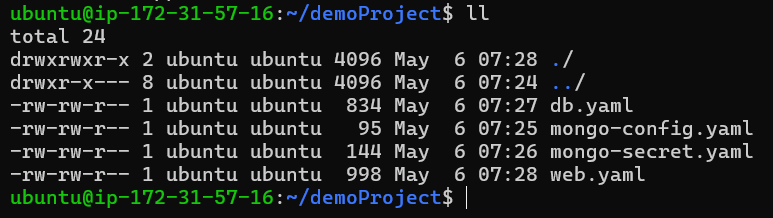  
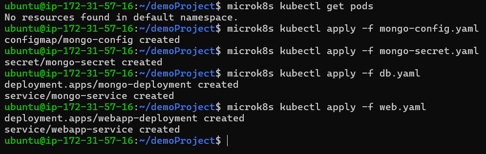  
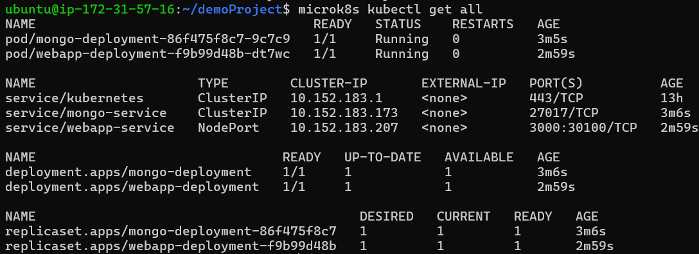  
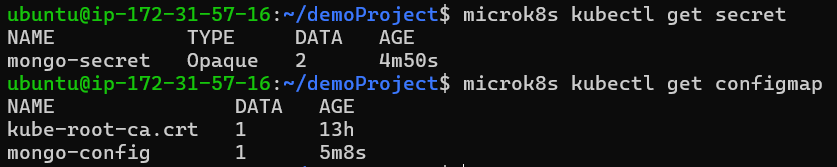  

- The difference lies in the deployment and service, as we have combined them in one file in part B. It would also have been possible to keep them separate.

#### 2. In der ConfigMap.yaml haben Sie die MongoUrl definiert, resp. sie war bereits definiert. Erklären Sie wieso der angegebene Wert korrekt ist.
- The specified MongoURL in mongo-config.yaml was correct, as we used the defined name in mongo-service. The name in mongo-service therefore points to the MongoDB.

#### 3. Zeigen Sie, dass die App installiert wurde. rufen Sie den Befehl `microk8s kubectl describe service webapp-service` auf mindestens zwei Nodes auf und erstellen Sie Screenshots des Resultats. 
*webapp service*  
Master:  
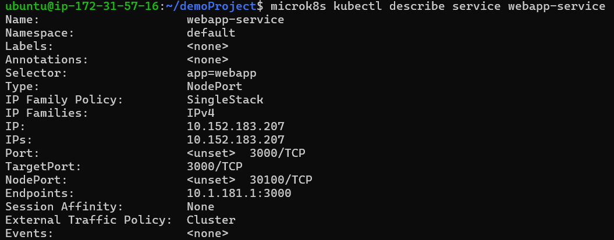  
Node 1:   
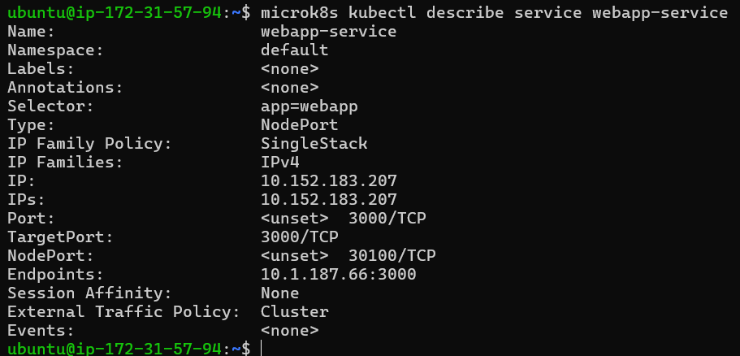  

#### 4. Rufen Sie nun den gleichen Befehl für den zweiten Service auf (nur auf einem der Nodes). Erstellen Sie einen Screenshot. Es gibt Unterschiede. Erklären Sie die Unterschiede in ein paar kurzen Sätzen.
*mongo service*  
Master:   
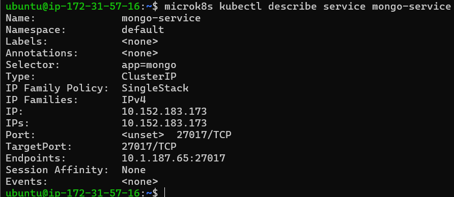  

Unterschied zwischen webapp service description and mongo service description:  

- Type: . In the (mongo-service), the type is *ClusterIP*, which means the service is only accessible internally within the cluster. In the (webapp-service), the type is *NodePort*, which means the service is exposed on each node's IP at a static port.

- NodePort: This field is present only in the description of webapp-service. It specifies the port on each node where the service is accessible.

- Endpoints: This field lists the IP addresses and ports of the actual pods backing the service. In mongo-service, there is one endpoint (10.1.187.65:27017), while in webapp-service, there are multiple endpoints (10.1.181.1:3000, 10.1.187.66:3000, 10.1.57.199:3000). 

#### 5. Screenshot der Seite, inkl. URL von mindestens zwei Nodes des Clusters und erklären Sie was Sie tun mussten.
Master node:  
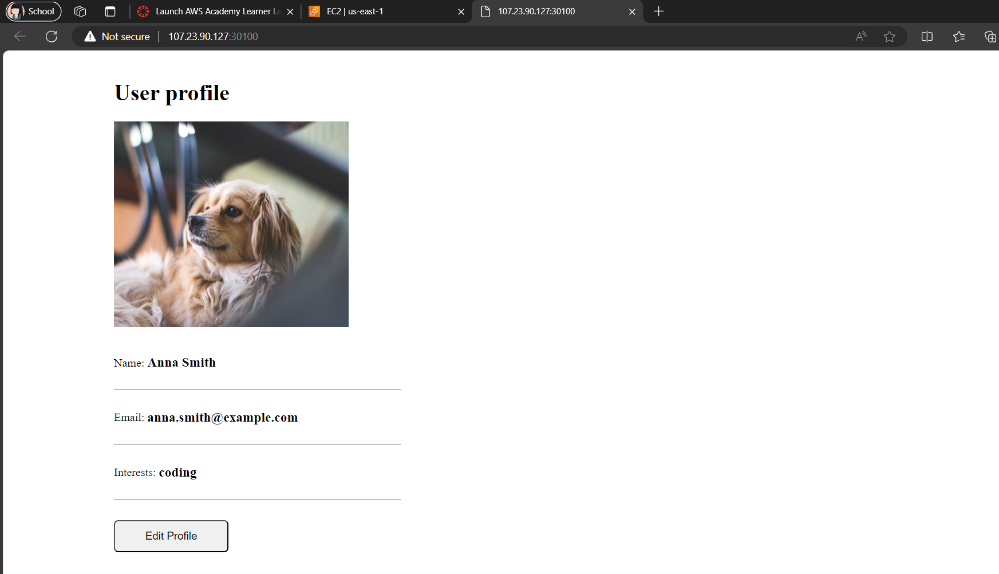  
Node 1:  
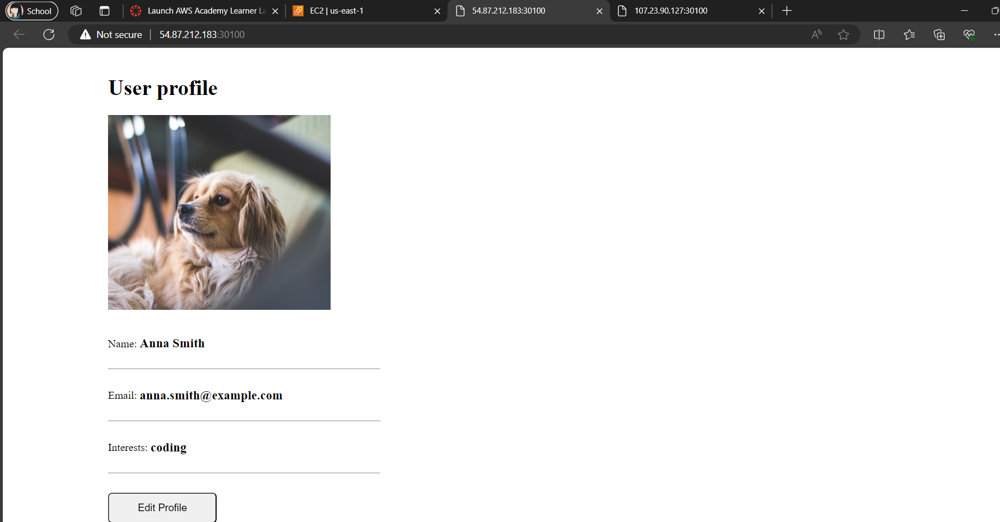  

- I had to add an inbound rule to the security group which allows port 30100, otherwise I can't access the website.

#### 6. Verbindung mit MongoDB Compass. Wieso geht es nicht? Begründen Sie was man im Service/Deployment ändern könnte, so dass es anschliessend geht?

- The connection to the database would not work because the port from Kubernetes and AWS is not open. We would have to open the port in db.yml and open it in AWS so that we could connect it with MongoDB Compass.

#### 7. Service Definition anpassen

- In web.yaml den NodePort (32000) und replicas (3) anpassen.
- Erklären Sie welche Schritte Sie durchführen müssen.
- Den Befehl `microk8s kubectl apply -f web.yaml` nochmals ausführen.
- Screenshot (von einem Node) mit der funktionierenden Webseite
- Screenshot des Befehls microk8s kubectl describe service webapp-service

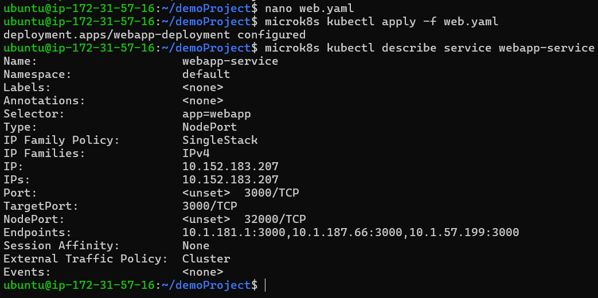  
- open the port 32000
- With the command `nano web.yaml` the changes to the yaml file could be implemnted.

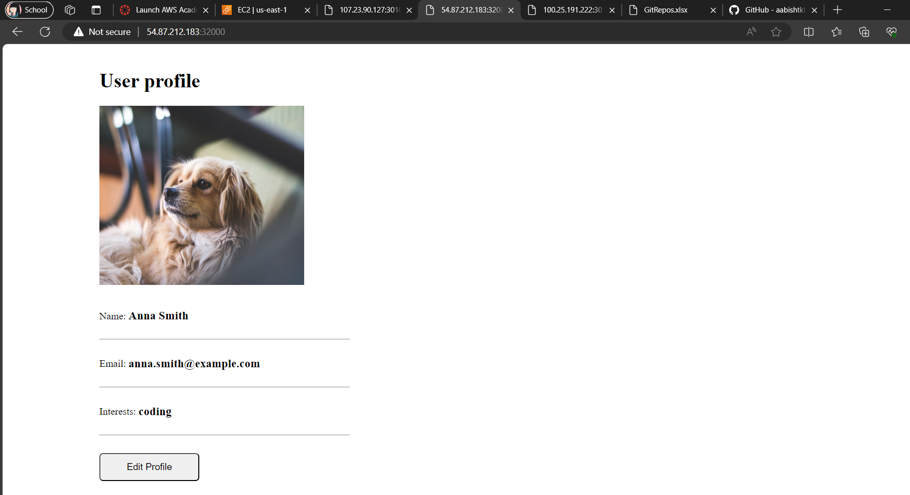  
