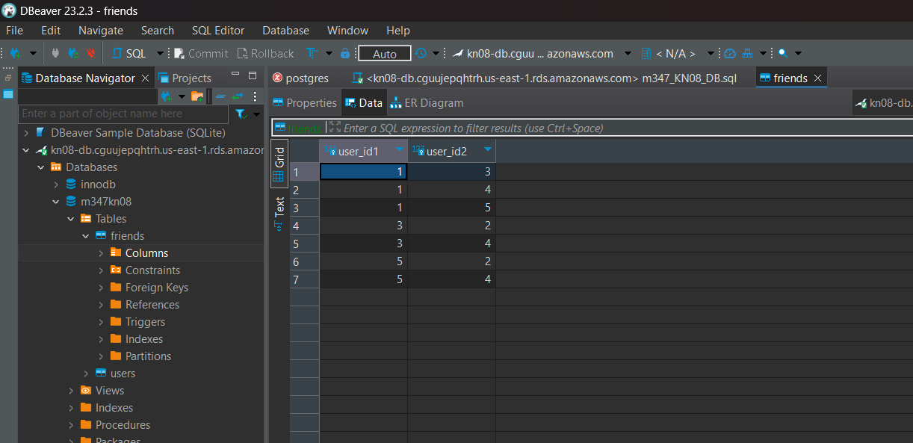
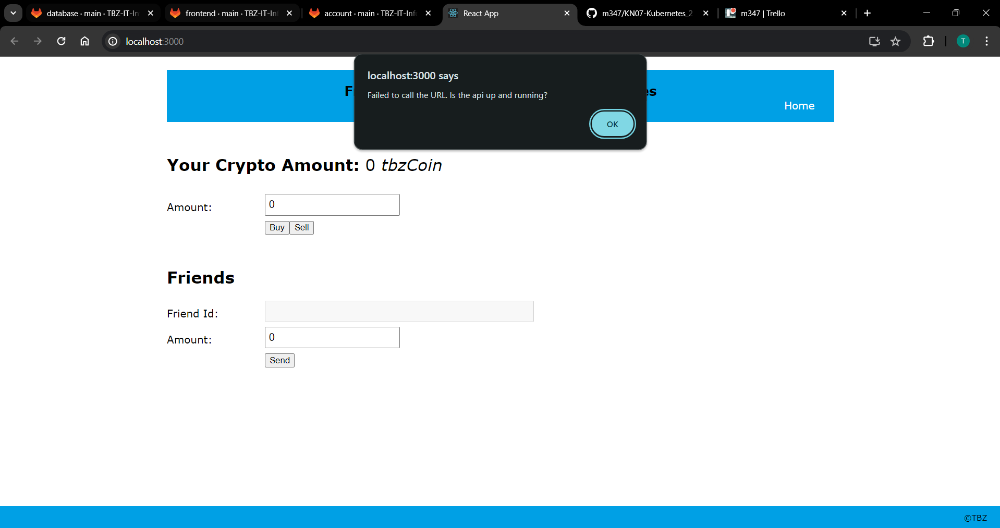
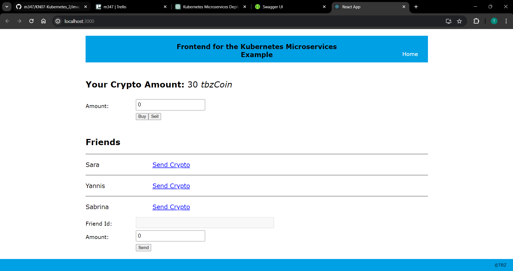
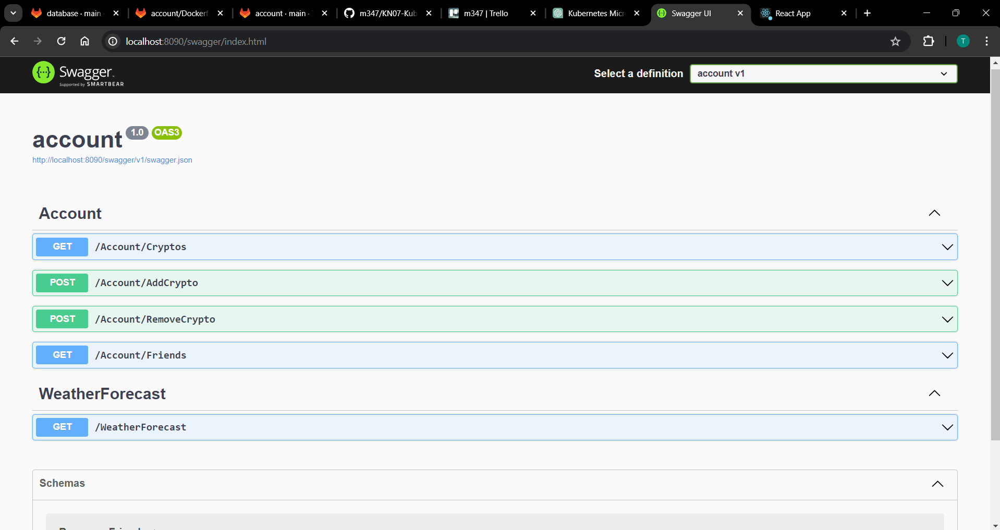
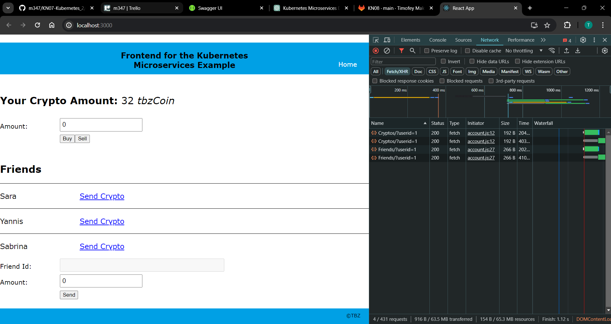

# KN08: Kubernetes III - microservices

### 1. Datenbank erstellen
  

### 2. FrontEnd Starten
  

### 3. Account Komponente Starten
  
  

### 4/5. Integration der Microservices testen
### 6. SendRecieve und BuySell Implementieren
  

### 7. Kubernetes Realisieren

### 8. App Update
