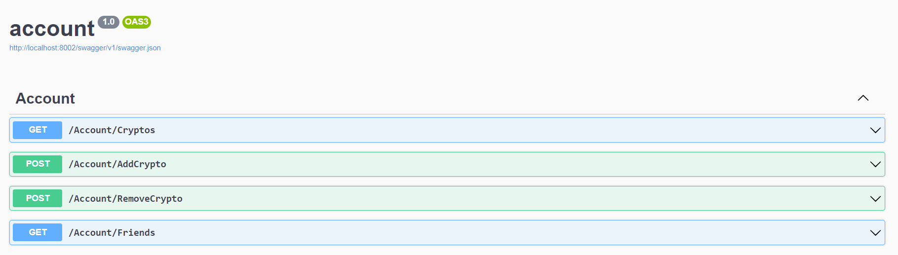

# Komponente Account

Der *Account  Microservice* ist in .NET geschrieben. Sie müssen den Code nicht ändern oder verstehen, sondern können die Komponente einfach anwenden. Folgende Schritte müssen Sie durchführen.

## AppSettings erstellen

Im Ordner *bin* finden Sie die Datei ***appsettings-template.json***. Diese müssen sie umbenennen in ***appsettings.json*** und den Inhalt anpassen. Die einzige Variable, die Sie dort finden, ist der ConnectionString auf die Datenbank.

## Applikation in Container packen

Das *Dockerfile* ist bereits vorgegeben. Erstellen Sie nun Ihren Container und rufen Sie die entsprechende URL auf.

## Applikation testen

Mit der Applikation wurde auch *swagger* installiert, welches Ihnen die Endpoints zeigt. Sie können so auch gleich den Zugriff auf die Datenbank testen.

Angenommen Ihre Applikation läuft auf Port 8080, dann ist die URL für swagger: http://localhost:8080/swagger/.

