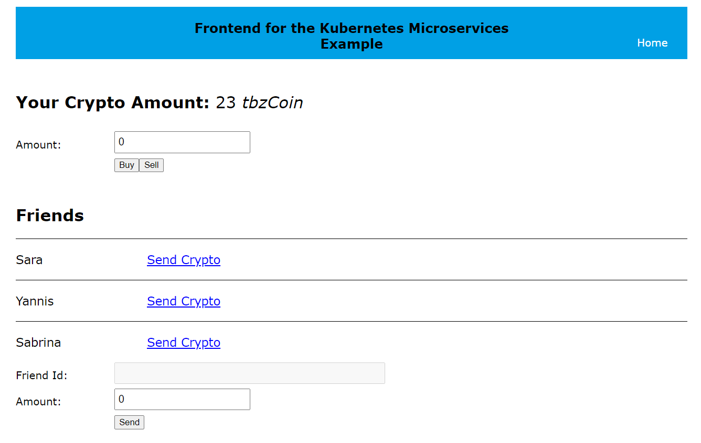

# Komponente Frontend

Die Frontend Applikation ist eine react-App ohne serverseitigen Code. **Die Applikation ist fertig und sollte nicht verändert werden!**

In der App finden sie zwei Environment-Dateien. 

- .env.development: Diese Variablen werden verwendet, wenn Sie die Applikation starten in der Development Umgebung. Sie können dies tun, wenn Sie die Applikation testen möchten, bevor Sie den Container erstellen. 

- .env.production: Diese Variablen werden verwendet, wenn Sie die Applikation erstellen. Dies bedeutet, dass die JavaScript und CSS Dateien zusammengeführt und minimiert werden. 

Sie können die Environment Variablen nicht mehr ändern, wenn Sie die Applikation einmal erstellt ist, sondern Sie müssen Sie neu erstellen.


## Applikation im Development Mode starten

- Öffnen Sie die Konsole und wechseln Sie in das Verzeichnis der Applikation
- Rufen Sie den Befehl `npm start` auf. Die Applikation startet. 

**Achtung**: Da zu diesem Zeitpunkt der *Account Microservice* nicht läuft, werden Sie Fehler kriegen. 


## Applikation in Container packen

- Öffnen Sie die Konsole und wechseln Sie in das Verzeichnis der Applikation
- Rufen Sie den Befehl `npm run build` auf. Die erstellt optimierte Dateien im Ordner *build*. 
- Das *Dockerfile* ist bereits vorgegeben. Erstellen Sie nun Ihren Container und rufen Sie die entsprechende URL auf.

**Achtung**: Die Konfiguration in den Environment Variablen für die Umgebung Kubernetes ist anders, als wenn Sie die Applikationen in Container starten. Sie müssen verstehen, welche Werte Sie zu welchem Zeitpunkt verwenden. Daher ist es notwendig, dass Sie die Applikation neu bauen (builden) können.


## Environmentvariablen

```
REACT_APP_ACCOUNT_HOLDINGS=https://localhost:7205/Account/Cryptos/?userid=<userId>
REACT_APP_ACCOUNT_FRIENDS=https://localhost:7205/Account/Friends/?userid=<userId>
REACT_APP_BUYSELL_BUY=http://localhost:8002/buy
REACT_APP_BUYSELL_SELL=http://localhost:8002/sell
REACT_APP_SENDRECEIVE_SEND=http://localhost:8003/send
REACT_APP_USER_LOGGED_IN=1
```

Die Endpoints wurden bereits im Auftrag beschrieben. Oben sehen Sie die verschiedenen Variablen, die sich auf die Endpoints beziehen. 

Die letzte Variable bezieht sich auf den Benutzer, der eingeloggt ist. Sie können diesen Wert auf eine beliebige ID aus der Datenbank setzen und so als unterschiedliche Benutzer einloggen. 


## Funktionsweise

Das folgende Bild zeigt die Applikation, wenn Daten korrekt geladen werden. 

- Ganz oben sehen Sie die Anzahl Coins, die der Benutzer besitzt. Der Wert wird aus dem endpoint `REACT_APP_ACCOUNT_HOLDINGS` gelesen. Dieser Teil ist bereits umgesetzt im *Account Microservice*.
- Gleich unterhalb finden Sie ein Formular, mit welchem Sie Cryptos im Markt kaufen können. die Endpoints sind `REACT_APP_BUYSELL_BUY` und `REACT_APP_BUYSELL_SELL`. Diesen Microservice müssen Sie noch umsetzen.
- Dann kommt die Friends-Liste, die bereits aus dem `Account Microservice` gelesen wird. Verwendet wird der Endpoint `REACT_APP_ACCOUNT_FRIENDS`. 
- Unterhalb finden Sie dann das Formular mit welchem Sie einem Freund Cryptos schicken können. Dazu wäre der Endpoint `REACT_APP_SENDRECEIVE_SEND` gedacht, den Sie noch umsetzen müssen. Sie finden weitere Informationen im Auftrag.



